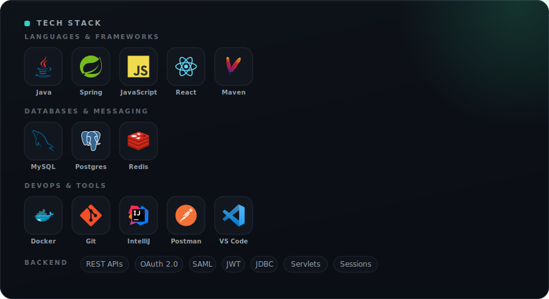

<!-- ============================================================= -->
<!--  Pratik Pawar · GitHub Profile                                -->
<!--  Self-contained dark UI cards — they read as intentional on   -->
<!--  BOTH GitHub light and dark themes, and every visual is a      -->
<!--  local SVG in ./assets, so nothing can break.                  -->
<!-- ============================================================= -->

&nbsp;&nbsp;&nbsp;&nbsp;

 

 

 

 

  <b>Always curious</b> · <b>Always building</b>

