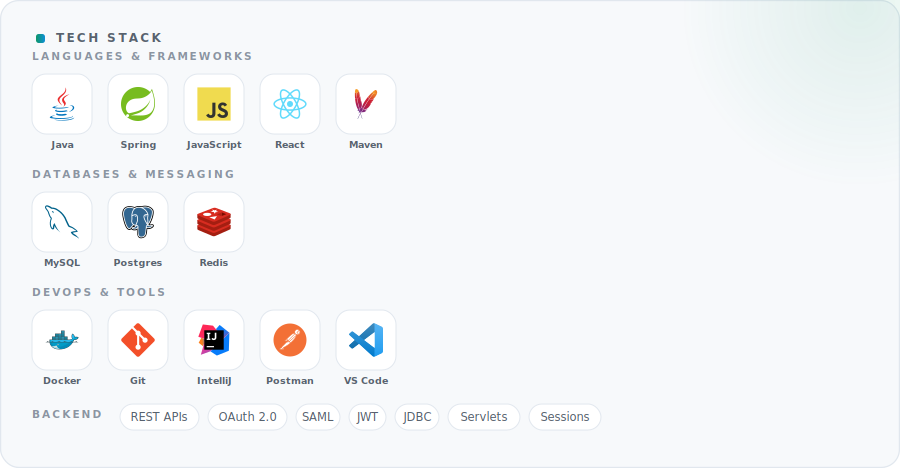

<!-- ============================================================= -->
<!--  Pratik Pawar · GitHub Profile                                -->
<!--  Polished & theme-adaptive. Every visual is a local SVG in    -->
<!--  ./assets (no external services, nothing can break), with     -->
<!--  light + dark variants swapped via <picture>.                 -->
<!-- ============================================================= -->

<picture>
  <source media="(prefers-color-scheme: dark)" srcset="assets/hero-dark.svg">
  
</picture>

<a href="https://blogs.prat.world"><picture><source media="(prefers-color-scheme: dark)" srcset="assets/badge-blog-dark.svg"></picture></a>&nbsp;&nbsp;<a href="https://linkedin.com/in/pratikpawar-"><picture><source media="(prefers-color-scheme: dark)" srcset="assets/badge-linkedin-dark.svg"></picture></a>&nbsp;&nbsp;<a href="mailto:pratikpawar2703@gmail.com"><picture><source media="(prefers-color-scheme: dark)" srcset="assets/badge-email-dark.svg"></picture></a>

 

<picture>
  <source media="(prefers-color-scheme: dark)" srcset="assets/flow-dark.svg">
  
</picture>

 

<picture>
  <source media="(prefers-color-scheme: dark)" srcset="assets/about-dark.svg">
  
</picture>

 

<picture>
  <source media="(prefers-color-scheme: dark)" srcset="assets/tech-dark.svg">
  
</picture>

 

  <b>Always curious</b> · <b>Always building</b>

